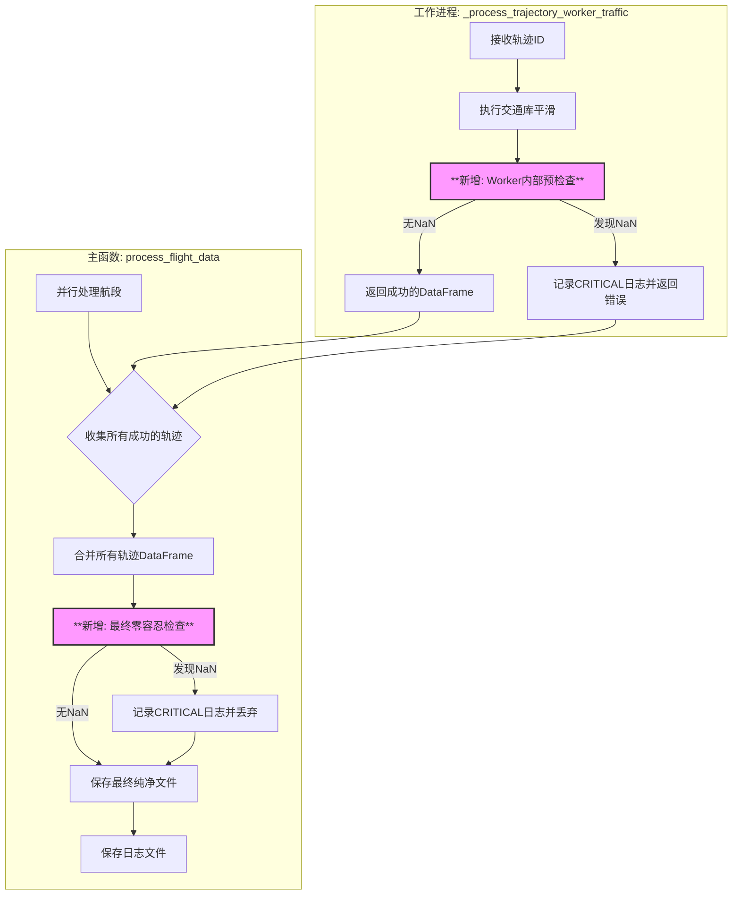

# 第五阶段：零容忍最终验证与输出 - 实施计划

## 1. 设计总览

本计划旨在为 `flight_data_preprocessor_traffic.py` 脚本集成一个最终的“零容忍”数据完整性验证阶段。核心目标是在数据输出前的最后一刻，捕获并丢弃任何仍包含 `NaN` 值的轨迹，确保最终交付数据的绝对纯净，并对意外情况留下清晰、严重的警告日志。

此设计遵循“双重保险”原则：
1.  **过程级检查**: 在每个独立的 `worker` 进程内部，对平滑处理后的单条轨迹进行首次验证。
2.  **全局级检查**: 在主进程中，将所有 `worker` 返回的、通过了首次验证的轨迹数据合并后，进行最终的、全局性的验证，然后再写入文件。

## 2. 实施蓝图 (Mermaid Diagram)

## 3. 详细修改步骤

### 步骤 3.1: 修改 `_process_trajectory_worker_traffic` 工作函数

**位置**: 在函数的 `return` 语句之前，即 `final_flight_meters` 计算之后。

**逻辑**:
1.  获取最终处理完的 `final_df_pandas` DataFrame。
2.  **实施检查**: 检查核心三列 `['longitude', 'latitude', 'altitude']` 是否存在任何 `NaN` 值。
3.  **处理结果**:
    *   **如果发现 `NaN`**:
        *   记录一条 `CRITICAL` 级别的日志，明确指出轨迹ID和问题所在。
        *   函数返回 `{"status": "error", "reason": "Post-smoothing NaN check failed"}`。
    *   **如果未发现 `NaN`**:
        *   函数正常返回 `{"status": "success", "data": ...}`。

### 步骤 3.2: 修改 `process_flight_data` 主处理函数

**位置**: 在 `pl.concat(all_final_dfs)` 之后，`final_df.write_csv/parquet` 之前。

**逻辑**:
1.  将所有 `worker` 返回的 `all_final_dfs` 合并成一个大的 `final_concat_df` Polars DataFrame。
2.  **实施最终检查**:
    *   定义一个表达式，检查 `['Lon', 'Lat', 'H']` 列中是否存在 `null` 值。
    *   使用 `filter` 分离出“纯净”和“受污染”的轨迹。
3.  **处理结果**:
    *   **如果发现受污染的轨迹**:
        *   提取出这些轨迹的 `ID`。
        *   对每一个受污染的 `ID`，记录一条 `CRITICAL` 级别的日志，内容与您的要求一致。
        *   将这些轨迹从主 `DataFrame` 中彻底移除。
    *   **输出纯净数据**:
        *   只将“纯净”的 `DataFrame` 写入最终的CSV或Parquet文件。

### 步骤 3.3: 增强日志记录

*   确保 `setup_logging` 函数配置正确，能够处理 `CRITICAL` 级别的日志。
*   在两个检查点（`worker` 和主流程）都使用统一且信息明确的 `CRITICAL` 日志格式，方便问题追溯。

## 4. 关键问题确认

*   **检查点位置**: 已确认，在 `worker` 和主流程中设置“双重”检查点。
*   **日志格式**: 已确认，使用 `[CRITICAL]` 级别和指定的日志消息模板。
*   **检查范围**: 已确认，最终检查的核心目标是 `Lon` (经度), `Lat` (纬度), `H` (高度) 三列。

此计划已获得您的批准，下一步将切换至“代码”模式进行实施。